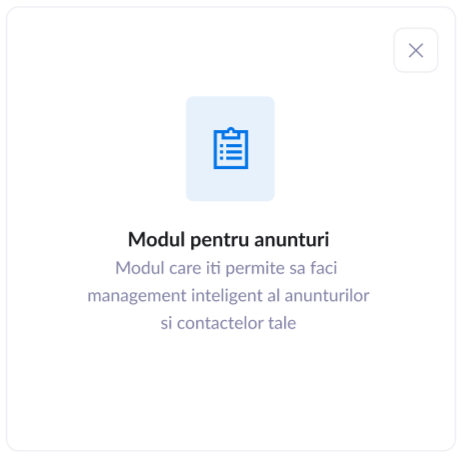
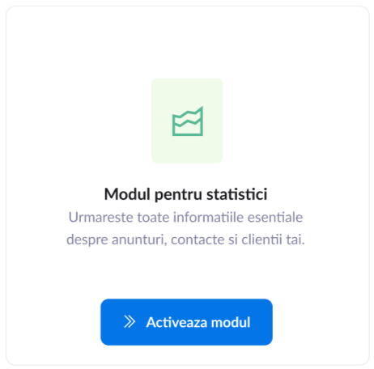

# TASKS

Repository URL: https://gitlab.com/softprovider-freelancers/panoro-crm-login .

Design URL: https://www.figma.com/file/rD9S6QJOrCS5o4pPtfoLHi/CRM---NOU?node-id=199%3A701
only the top part named "LOGIN / Signup / recover".

## General

-   All the tasks must be worked on this repository;
-   Additional packages must be asked permission first before installed and
    used;
-   The project structure defined in `README.md` must be respected;
-   The file naming and structure defined in `README.md` must be respected;
-   Always use Tailwind classes;
    -   If the value/color is repeated multiple times it should be added to the
        TailwindCSS theme;
-   The project must be done in TypeScript.
-   The design must be responsive (mobile screens, tablet screens,
    laptop screens and 4k screens)

## PanoroCRM Login

-   The design is only the top part named "LOGIN / Signup / recover":
    -   The missing UI elements from the mobile design that are present on the
        desktop side should be also added to the mobile side;
    -   On screen "Module disponibile 2" there should be a button below all the
        modules list with "Ok" that will go back the user to "Module 
        disponibile" screen;
    -   On screen "Module disponibile 2" will be displayed all the modules.
        If one module is already activated than the button will be gray
        saying "Already activated. Deactivate" and when pressed will
        delete the deactivate the module making the button blue again
        with the label from design - see user flow for better understanding;
    -   On the mobile screen of "Module disponibile 2" tapping a module will
        activate or deactivate it;
-   Checking on client-side and show error if the password is less than
    `src/data/MinimumPasswordLength.ts` characteres;
-   Handle errors from the server;
-   See `user_flow_diagram.svg` for the user flow that must be implemented accordingly;
-   The **Register page** should be created as a single page holding all the
    data and each section be created as components and lazy loaded;
-   The phone inputs should be done using `react-phone-input-2`;
-   The data for the `accountType` represented by the select "Tip persoana" from
    the screen "Sign up" can be found `src/data/AccountType.ts`;
-   The data for the `businessActivity` represented by the select "Obiect de
    activitate" from the screen "Details" can be found
    `src/data/BusinessActivity.ts`;
-   The data for the `employees` represented by the select "Angajati" from the
    screen "Details" can be found `src/data/EmployeesSelect.ts`;
-   If the `accountType` is `AccountType.PERSON` then the register step
    represented by the screen "Details" is skipped and shown directly the "Module
    disponibile" screen;
-   The localization strings for `accountType`, `businessActivity`, `employees`
    can be found in the `localization/ro` directory;

## Components

The pages and components files were already created and are the following:

### Base

**File**: `src/components/Base.tsx`  
**Details**: The base component that renders the blue part of all pages and as
children are the actual pages

### LoginPage

**File**: `src/pages/LoginPage.tsx`  
**Figma panel**: Sing in / Sign in [Mobile]  
**URL**: /login  

### RecoverPasswordPage

**File**: `src/pages/RecoverPasswordPage.tsx`  
**Figma panel**: Recover, Finish parola resetata / Recover[Mobile]  
**URL**: /recover  
**Details**: The mobile design panel for the finish is missing, but follow the
panel "Finish [mobile]"  

### RegisterPage

**File**: `src/pages/RegisterPage.tsx`  
**Figma panel**: Sign Up, Details, Module disponibile, Module disponible 2,
Module disponible, Finish / Sign Up [Mobile], Details [Mobile], Finish [Mobile]   
**URL**: /signup  

### recover_password/FormSection

**File**: `src/components/recover_password/FormSection.tsx`  
**Figma panel**: Recover / Recover[Mobile]  
**Details**: The form with the details for recovering the password

### recover_password/SuccessSection

**File**: `src/components/recover_password/FormSection.tsx`  
**Figma panel**: Finish parola resetata  
**Details**: The design for the mobile part is missing, but follow "Finish
[Mobile]"

### register/BasicFieldsFormSection

**File**: `src/components/register/BasicFieldsFormSection.tsx`  
**Figma panel**: Sign Up / Sign Up[Mobile]  

### register/BusinessFieldsFormSection

**File**: `src/components/register/BusinessFieldsFormSection.tsx`  
**Figma panel**: Details / Details [Mobile] (first one)  
**Details**: This phase is displayed only if the user selected
AccountType.BUSINESS at the previous phase

### register/ModulesSection

**File**: `src/components/register/ModulesSection.tsx`  
**Figma panel**: Module disponible / Details [Mobile] (second one)  
**Details**: This phase will contain the selected modules of the user. At first
will contains no modules, but when user clicks on "Descopera mai multe module"
the component DiscoverModules will open and allow for
user to add/select modules, or deselect them.  
Each module added from the DiscoverModules component then will be seen in this
component.

### register/DiscoverModules

**File**: `src/components/register/DiscoverModules.tsx`  
**Figma panel**: Module disponible 2 / Details [Mobile] (third one)  
**Details**: This component contains all the modules available to the user
that are retrived from with the API. In the bottom of the page will be a button
named "OK" that return to the ModulesSection phase.

### register/Module

**File**: `src/components/register/Module.tsx`  
**Details**: A singular module component. The `data` props is the data received
from the API. The `actionButton` is the blue button from the modules in the
panel "Module disponibile 2".

### register/SuccessRegisteredSection

**File**: `src/components/register/SuccessRegisteredSection.tsx`  
**Figma panel**: Finish / Finish [Mobile]  

## API

### Login

**Path**: `/api/users/login`  
**Method**: `POST`  
**Content-Type**: `application/json`  
**Params**:

-   `username` : string - the name of the user
-   `password` : string - the password of the user

**Returns**:

-   `200`, `true` - login with success
-   `400`, `error message` - failed to login

Request for login to the CRM.  
For testing the only result will return `200` is for:

-   username: `user@mail.com`;
-   password: `123456`.

### Register

**Path**: `/api/users/register`  
**Method**: `POST`  
**Content-Type**: `application/json`  
**Params**:

-   `username` : string - the name of the new user;
-   `password` : string - the password of the new user;
-   `email`: string - the email of the new user;
-   `modules`: string[] - the modules the user selected;
-   `accountType`: number - the type of account;
-   `[businessActivity]`: number - the business activity; required if the
    `accountType` is `AccountType.BUSINESS`;
-   `[businessName]`: string - the business name; required if the `accountType`
    is `AccountType.BUSINESS`;
-   `[businessPhoneNumber]`: string - the business phone number; required if the
    `accountType` is `AccountType.BUSINESS`;

**Returns**:

-   `200`, `true` - registered with success;
-   `400`, `{ field: string; error: string }` - failed to register; returning
    an object where parameter `field` is the field that failed and `error` is
    the error message.

Request for registering to the CRM.

### Recover password

**Path**: `/api/users/recover_password`  
**Method**: `POST`  
**Content-Type**: `application/json`  
**Params**:

-   `email` : string - the email for recovering the password

**Returns**:

-   `200`, `true`

Request for recovering the password of an user.

### Get modules

**Path**: `/api/modules`  
**Method**: `GET`  
**Content-Type**: `application/json`  
**Params**: nothing  
**Returns**:

-   `200`, `{ id: string; icon: string, color: string, name: string, description: string }[]` -
    login with success

Request for getting the modules. The `id` is the string that will must be sent
to the register request in the `modules` array. The `icon` is the path to the
SVG image of the module. The `color` is the color for the SVG. The `name`
and `description` are the text for the title and description for the module.
